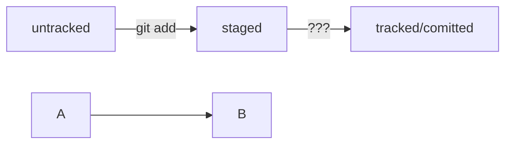

# Заголовок 1
---
Это тестовый проект!
## Подзаголовок 1
## Подзаголовок 2

1. Один
2. Два
3. Три
---
* ффф
* ввв
* ссс

~~ЗАЧЕРКНЕМ ЭТУ ФРАЗУ~~

_А ЭТО КУРСИВ_

**ЖИРНЫЙ, ПРЯМ КАК Я**

[ССЫЛКА НА ЭТОТ РЕПОЗИТОРИЙ](https://github.com/qwerty2024/first_project.git "Подсказочка!")

```cpp
#include <iostream>

int main()
{
		std::cout << "Hello World!" << std::endl;
}
```

